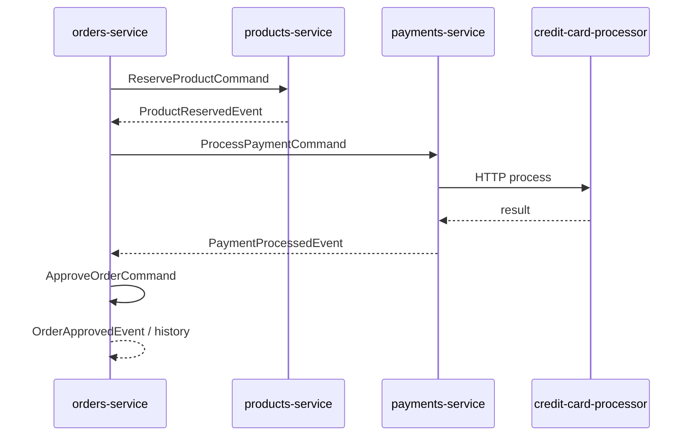
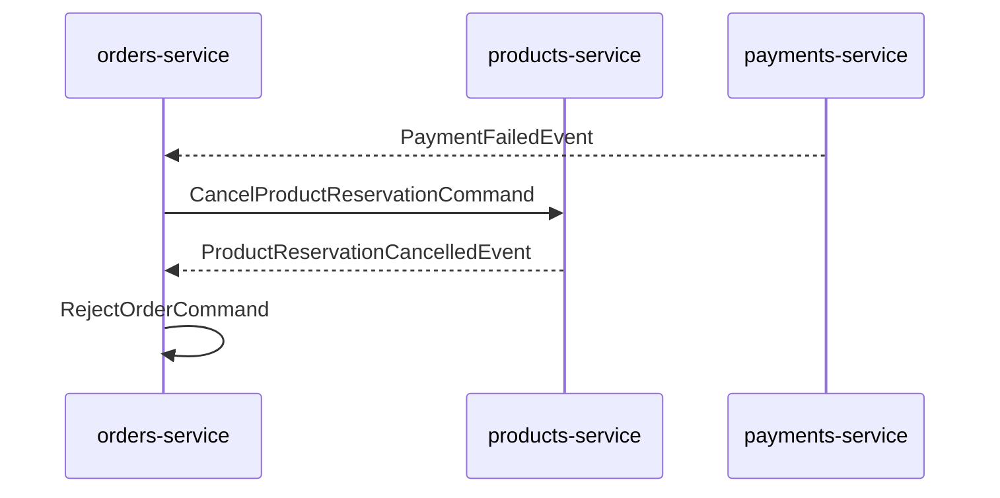

# saga-pattern-spring-boot

Demonstration of the **SAGA orchestration** pattern with Spring Boot and Apache Kafka: one service coordinates long-running business transactions by issuing commands and reacting to events from other bounded contexts.

## Contents

- [How the saga works](#how-the-saga-works)
- [Kafka topics](#kafka-topics)
- [Project overview](#project-overview)
- [Tech stack](#tech-stack)
- [Prerequisites](#prerequisites)
- [Infrastructure](#infrastructure)
- [Build](#build)
- [Run services](#run-services)
- [API quick check](#api-quick-check)
- [Configuration notes](#configuration-notes)
- [Troubleshooting](#troubleshooting)

## How the saga works

Orchestration lives in **orders-service**: `OrderSaga` listens to domain events from `orders-events`, `products-events`, and `payments-events`, then publishes commands to `products-commands`, `payments-commands`, and `orders-commands`. Each participant service reacts to its command topic and publishes outcomes as events.

Happy path: order created → product reserved → payment processed → order approved.

If payment fails, the saga sends a compensating command to cancel the product reservation, then rejects the order.



Compensation path (payment failure):



If the credit card processor is unreachable from **payments-service**, `CreditCardProcessorUnavailableException` maps to `PaymentFailedEvent`, so the same compensation path runs.

### Where the code lives

| Role | Module | Main types |
|------|--------|------------|
| Saga orchestrator | `orders-service` | `io.github.levasey.saga.orders.saga.OrderSaga` |
| Order REST API and persistence | `orders-service` | `OrdersController`, `OrderServiceImpl`, `OrdersCommandsHandler` |
| Product reservations | `products-service` | `ProductCommandsHandler`, `ProductServiceImpl` |
| Payments and CCP client | `payments-service` | `PaymentsCommandsHandler`, `PaymentServiceImpl`, `CreditCardProcessorRemoteServiceImpl` |
| Mock external gateway | `credit-card-processor-service` | `CreditCardProcessorController` (`POST /ccp/process`) |
| Shared contracts | `core` | Commands, events, DTOs under `io.github.levasey.saga.core` |

### Kafka topics

Topics are created at startup via Spring (`NewTopic` beans). Names default to:

| Topic | Typical publisher |
|-------|-------------------|
| `orders-events` | orders-service |
| `orders-commands` | orders-service (saga) |
| `products-commands` | orders-service (saga) |
| `products-events` | products-service |
| `payments-commands` | orders-service (saga) |
| `payments-events` | payments-service |

The Docker Compose stack runs **three** Kafka brokers so topics can use replication factor `3` (see `KafkaConfig` in each service).

Bootstrap servers (all services): `localhost:9092`, `localhost:9094`, `localhost:9096`.

For Kafka CLI tips (topics, consumer groups, KRaft), see [docs/kafka-linux-kraft.md](docs/kafka-linux-kraft.md).

## Project Overview

This repository contains a multi-module Spring Boot demo that models an order flow across several services.

Modules:
- `core` - shared DTOs, enums, and common exceptions.
- `orders-service` - accepts order creation requests and stores order state.
- `products-service` - manages products and reservation/cancellation logic.
- `payments-service` - processes payment and calls credit card processor service.
- `credit-card-processor-service` - mock external credit card processor endpoint.

## Tech Stack

- Java 17
- Spring Boot 3.2.5
- Maven (multi-module build)
- PostgreSQL 16 (via Docker)
- Apache Kafka 4.x (KRaft, Bitnami images in Compose)
- Docker Compose (local infra)

## Prerequisites

- JDK 17+
- Maven 3.9+
- Docker + Docker Compose

## Infrastructure

Start PostgreSQL and Kafka cluster:

```bash
docker compose up -d
```

Wait until Postgres is healthy and all Kafka brokers are up before starting the applications.

This starts:

- **PostgreSQL** (`postgres:16-alpine`) on `localhost:5434` (default user/password: `saga` / `saga`)
- **Kafka** — three brokers (`bitnamilegacy/kafka:4.0.0-debian-12-r10`, KRaft) exposed on `localhost:9092`, `localhost:9094`, `localhost:9096`

Stop containers (data volumes are kept):

```bash
docker compose down
```

Remove volumes as well for a clean reset (drops broker and Postgres data):

```bash
docker compose down -v
```

Databases are initialized from `docker/postgres/init-databases.sql`:
- `orders`
- `products`
- `payments`

## Build

From repository root:

```bash
mvn clean install
```

## Run Services

Run each service in a separate terminal. There is no strict order, but **credit-card-processor-service** should be up before **payments-service** handles payments, and all Kafka-backed services expect the Docker stack running.

Typical order:

1. `credit-card-processor-service` (external dependency for payments)
2. `products-service` and `payments-service` (create event topics and handle commands)
3. `orders-service` (REST API and saga orchestration)

```bash
mvn -pl credit-card-processor-service spring-boot:run
mvn -pl products-service spring-boot:run
mvn -pl payments-service spring-boot:run
mvn -pl orders-service spring-boot:run
```

Default ports:
- `orders-service`: `8080`
- `products-service`: `8081`
- `payments-service`: `8082`
- `credit-card-processor-service`: `8084`

## API Quick Check

List products (optional, to copy a `productId`):

```bash
curl http://localhost:8081/products
```

Create product:

```bash
curl -X POST http://localhost:8081/products \
  -H "Content-Type: application/json" \
  -d '{
    "name": "Laptop",
    "price": 1000,
    "quantity": 5
  }'
```

Create order (returns `202 Accepted` with order details including `orderId`):

```bash
curl -X POST http://localhost:8080/orders \
  -H "Content-Type: application/json" \
  -d '{
    "customerId": "11111111-1111-1111-1111-111111111111",
    "productId": "PUT_PRODUCT_ID_HERE",
    "productQuantity": 1
  }'
```

Get order history (status transitions as the saga runs):

```bash
curl http://localhost:8080/orders/PUT_ORDER_ID_HERE/history
```

After a successful flow you should see entries such as `CREATED` and `APPROVED`; if payment fails after a reservation, expect `REJECTED` after compensation.

## Configuration Notes

- Service configs are in each module under `src/main/resources/application.properties`.
- Database connection can be overridden with environment variables:
  - `POSTGRES_HOST`
  - `POSTGRES_PORT`
  - `POSTGRES_DB`
  - `POSTGRES_USER`
  - `POSTGRES_PASSWORD`
- `payments-service` uses `remote.ccp.url` (default `http://localhost:8084`) to call credit card processor.
- Kafka bootstrap servers can be overridden with the standard Spring Boot property, for example `SPRING_KAFKA_BOOTSTRAP_SERVERS=host:9092` (comma-separated list).

## Troubleshooting

- **Services fail on startup with Kafka or DB errors** — wait until `docker compose ps` shows Postgres healthy and all three Kafka containers running; cold starts can take a minute.
- **`Connection refused` to Postgres** — confirm port `5434` matches `application.properties` in each service (defaults align with Compose).
- **Payments stall or saga never completes** — start **credit-card-processor-service** before exercising payments; **payments-service** must reach `http://localhost:8084/ccp/process`.
- **Topic or replication errors** — this demo expects replication factor `3`; run the full three-broker Compose stack, not a single-broker Kafka.

For inspecting topics, consumer groups, and KRaft basics on Linux, see [docs/kafka-linux-kraft.md](docs/kafka-linux-kraft.md).
